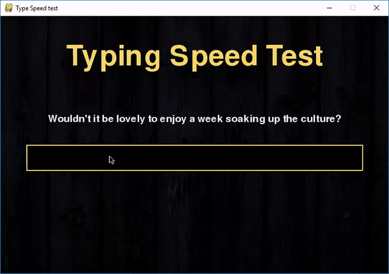

# Typing-Speed-Test
It’s a very useful game to track your typing speed and improve it with regular practice.

The project is in Python and uses the pygame library.
To install the pygame library, type the following code in your terminal.       
-> pip install pygame

To run the program, type the following code in your terminal.                                     
-> python speedtyping.py

